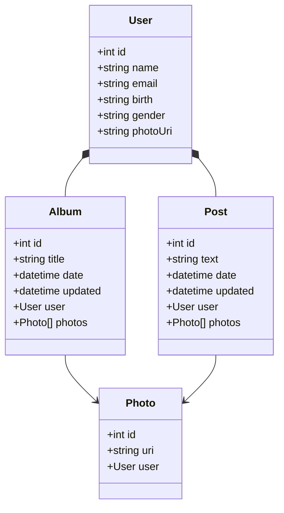

# Social Media

## Diagrama de Classes

```mermaid
classDiagram
    class User {
        +int id
        +string name
        +string email
        +string birth
        +string gender
        +string photoUri
    }

  class Post {
        +int id
        +string text
        +datetime date
        +datetime updated
        +User user
        +Photo[] photos
    }

  class Album {
        +int id
        +string title
        +datetime date
        +datetime updated
        +User user
        +Photo[] photos
    }

  class Photo {
        +int id
        +string uri
        +User user
    }

  User *-- Post
  User *-- Album
  Album --> Photo
  Post --> Photo
```
